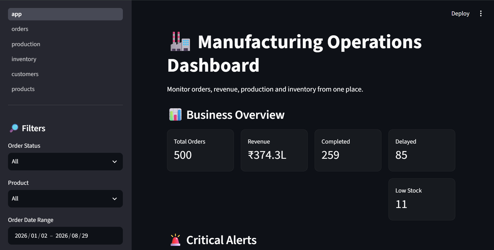

# Manufacturing Operations Dashboard

A manufacturing analytics dashboard built to monitor orders, production, inventory, customers, and product performance.

## Project Overview

This project simulates a real-world manufacturing analytics system where operational data is stored in a relational SQLite database and analyzed using Python, Pandas, SQL, and Streamlit.

The dashboard helps identify operational issues and provides business insights through interactive analytics.


## Features

- Order monitoring
- Order status analysis
- Revenue analysis
- Product performance analysis
- Customer performance analysis
- Production monitoring
- Defect rate analysis
- Inventory monitoring
- Low-stock alerts
- Out-of-stock alerts
- Delayed-order alerts
- Interactive dashboard navigation

## Tech Stack

- Python
- Pandas
- SQL
- SQLite
- Streamlit

## Database

The project uses SQLite with five relational tables:

- Customers
- Products
- Orders
- Production
- Inventory

## Data Quality

A Python data-quality script checks:

- Number of records
- Duplicate records
- Missing values

## Project Structure

```text
manufacturing_dashboard/
│
├── dashboard/
│   ├── app.py
│   └── pages/
│       ├── 1_Orders.py
│       ├── 2_Production.py
│       ├── 3_Inventory.py
│       ├── 4_Customers.py
│       └── 5_Products.py
│
├── data/
│   ├── customers.csv
│   ├── products.csv
│   ├── orders.csv
│   ├── production.csv
│   └── inventory.csv
│
├── database/
│   └── manufacturing.db
│
├── src/
│   ├── generate_data.py
│   ├── create_database.py
│   ├── test_database.py
│   └── data_quality.py
│
├── README.md
└── requirements.txt

## How to Run Locally

1. Clone this repository
2. Install dependencies: `pip install -r requirements.txt`
3. Run the app: `streamlit run dashboard/app.py`